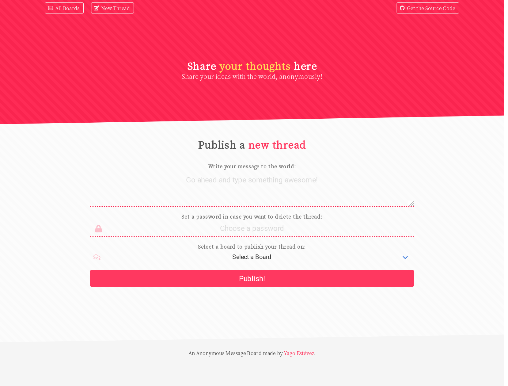

# Anonymous Message Board
#### Project made for the "Information Security & Quality Assurance" module in freeCodeCamp 
---

This is a project I made for the freeCodeCamp curriculum where the camper was asked to do an Anonymouse Message Board as a back-end project using **MongoDB**, **Express** and **Node**. The client side was not a requisite, but I made it a fullstack MERN app from start to finish by using **React** + **React Router** for the interactivity and **Bulma** for the styling.

#### Screenshot



#### Try it out!

If you want to try the converter, open [this link on Glitch](https://yagoestevez-anon-msg-board.glitch.me/).

#### Test the app

To test the server app, just do ```cd Backend```, run ```npm i``` and ```npm test```.

#### User Stories

These are the requirements for this project. They are all fullfilled.

1. Nothing from my website will be cached in my client as a security measure.
2. I will see that the site is powered by 'PHP 4.2.0' even though it isn't as a security measure.
3. I can post a title to /api/books to add a book and returned will be the object with the title and a unique _id.
4. I can get /api/books to retrieve an aray of all books containing title, _id, & commentcount.
5. I can get /api/books/{_id} to retrieve a single object of a book containing title, _id, & an array of comments (empty array if no comments present).
6. I can post a comment to /api/books/{_id} to add a comment to a book and returned will be the books object similar to get /api/books/{_id}.
7. I can delete /api/books/{_id} to delete a book from the collection. Returned will be 'delete successful' if successful.
8. If I try to request a book that doesn't exist I will get a 'no book exists' message.
9. I can send a delete request to /api/books to delete all books in the database. Returned will be 'complete delete successful' if successful.
10. All 6 functional tests required are complete and passing.


---

[Yago Estévez](https://twitter.com/yagoestevez)
